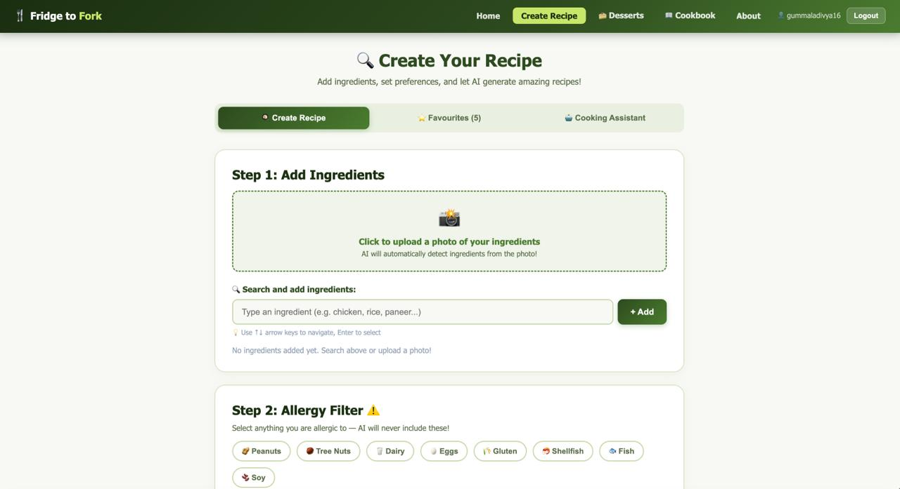
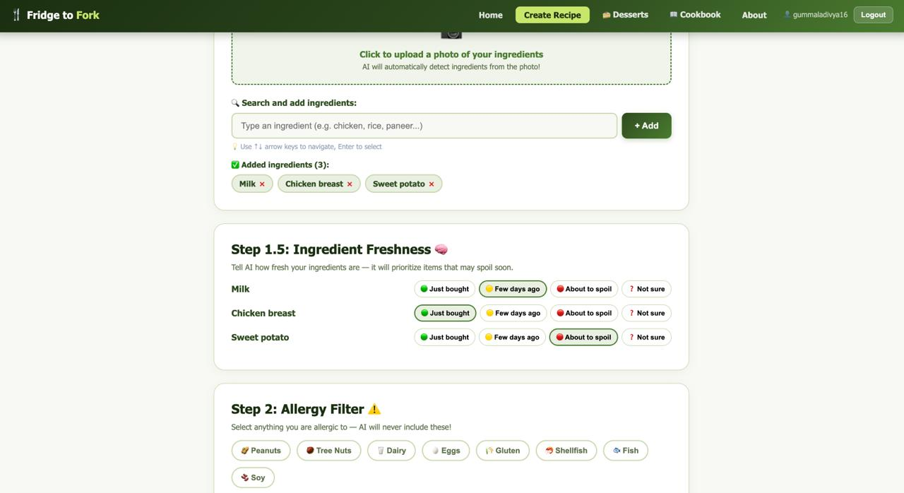
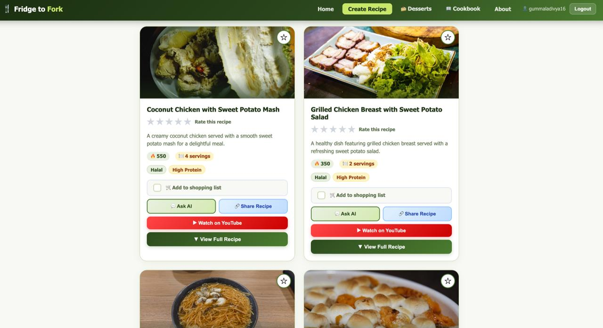
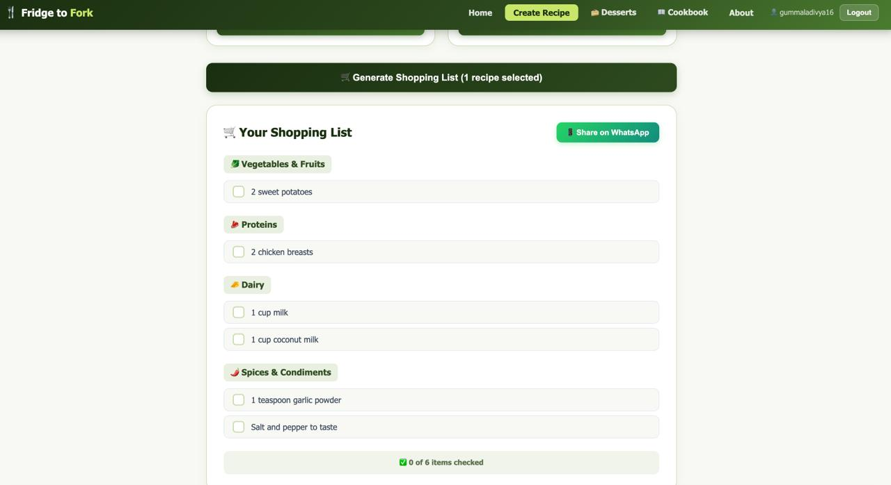
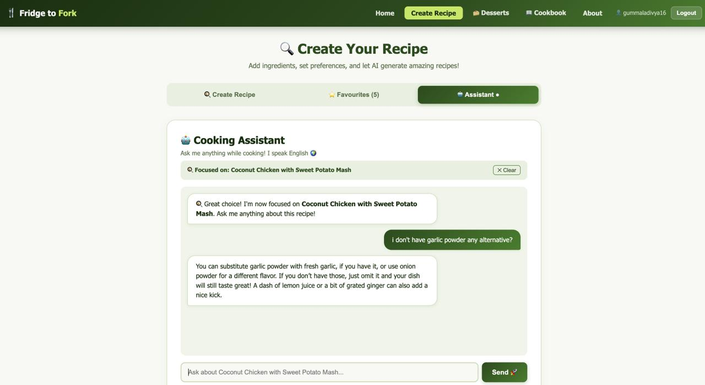

# 🥗 Fridge-to-Fork AI

### Smart AI Platform That Turns Your Ingredients Into Personalized Recipes

Fridge-to-Fork AI is an intelligent cooking assistant that transforms available ingredients into practical, healthy, and delicious recipes using artificial intelligence.

It is designed to reduce food waste, simplify meal planning, and support diverse dietary needs.

---

## 📸 Application Preview

### 🔍 Create Recipe Interface



### 🧠 Ingredient Freshness Selection



### 🍳 AI Generated Recipes



### 🛒 Smart Shopping List



### 🤖 Cooking Assistant Chat



---

## 🚨 Problem Statement

Many households struggle with:

* Food waste from unused ingredients
* Not knowing what to cook
* Dietary restrictions and allergies
* Limited kitchen equipment
* Lack of personalized recipes
* Time-consuming meal planning

---

## 💡 Our Solution

Fridge-to-Fork AI generates customized recipes based on:

* Available ingredients
* Health goals
* Dietary preferences
* Allergies
* Kitchen equipment
* Ingredient freshness
* Preferred language

---

## 🌟 Complete Feature Set

Fridge-to-Fork AI is designed as a full intelligent cooking ecosystem.

### 🥬 Ingredient Acquisition

* Manual ingredient search with autocomplete
* Large ingredient database
* AI detection from uploaded photos

### 🧠 Freshness-Aware Cooking

* Users mark how fresh ingredients are
* AI prioritizes items that may spoil soon
* Helps reduce food waste

### ⚠️ Allergy & Dietary Management

* Allergen exclusion system
* Support for vegetarian, vegan, keto, gluten-free, dairy-free, halal, kosher, and more

### 🎯 Health & Nutrition Personalization

* Weight loss / gain
* High protein
* Diabetic-friendly
* Heart healthy
* Low carb
* Balanced diet

### 🍳 Equipment-Aware Recipes

AI suggests only recipes that can be cooked using available tools.

### 🌍 Multi-Language Support

Recipes generated in multiple languages.

### 🤖 AI Recipe Generation

Includes ingredients, instructions, calories, servings, dietary tags, and tips.

### 🖼️ Visual & Video Guidance

Relevant food images and tutorial videos included.

### 💬 Interactive Cooking Assistant

Real-time chatbot for cooking help.

### ⭐ Personalization

* Favourite recipes
* Recipe history stored in cloud

### 🛒 Smart Shopping List Generator

Automatically consolidates ingredients into categorized lists with checklist support.

### 📤 Sharing Features

Share recipes and shopping lists easily.

### 🍰 Dessert Generator

Dedicated module for dessert recipes.

### 📷 Computer Vision Module

Detects ingredients from uploaded photos.

---

## 🧱 Tech Stack

**Frontend:** React.js
**Backend:** Node.js, Express.js

**AI & APIs:**

* OpenAI API
* Computer vision for ingredient detection
* Unsplash API
* YouTube API

**Database & Authentication:**

* Firebase Firestore
* Firebase Authentication

---

## 🌱 Impact

Fridge-to-Fork AI helps:

* Reduce household food waste
* Promote healthier eating
* Save time and money
* Improve cooking accessibility
* Support sustainable living

---

## 🚀 Future Enhancements

* Smart meal planning
* Expiry prediction alerts
* Nutrition tracking dashboard
* Voice assistant integration
* Mobile app version
* Smart fridge integration

---

## 🧪 Installation & Setup

```bash
git clone https://github.com/gdivya29-06/Fridge-To-Fork.git
cd Fridge-To-Fork
npm install
npm start
```

Backend:

```bash
cd backend
npm install
npm run dev
```

---

## ⭐ Acknowledgment

Developed as an academic project exploring AI-driven solutions for smart cooking and food sustainability.
