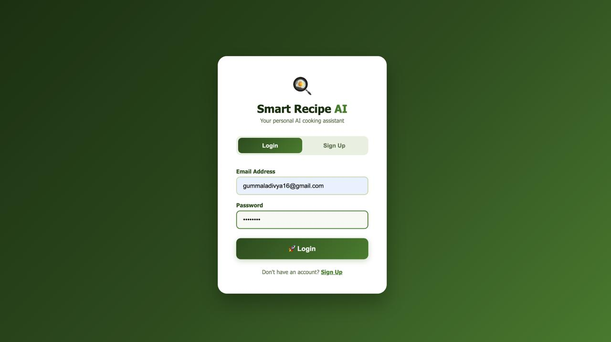
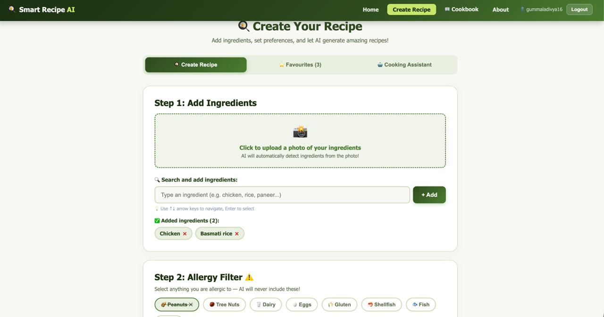
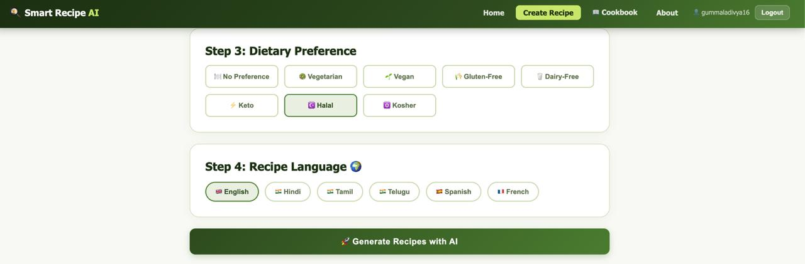
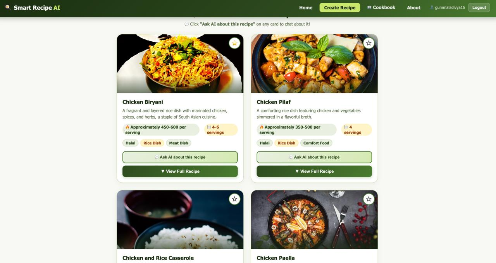
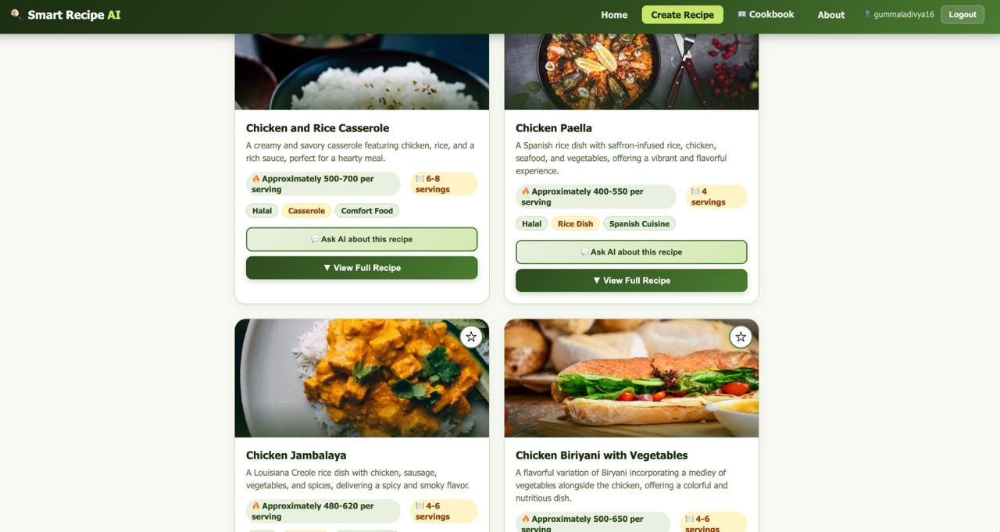
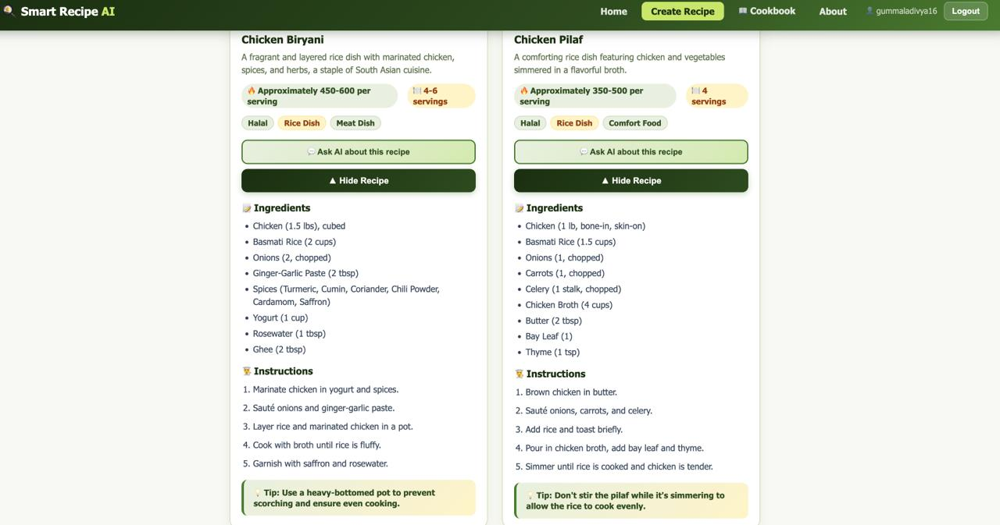
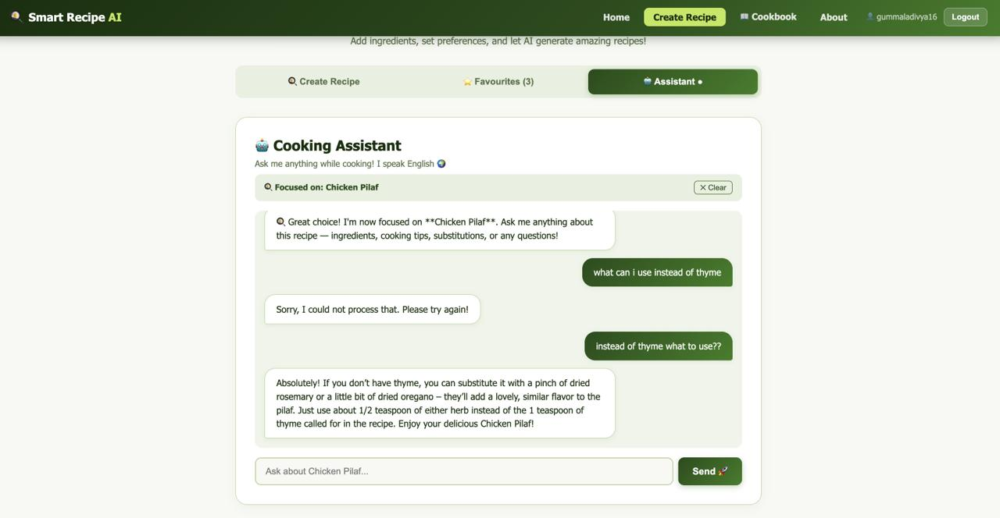
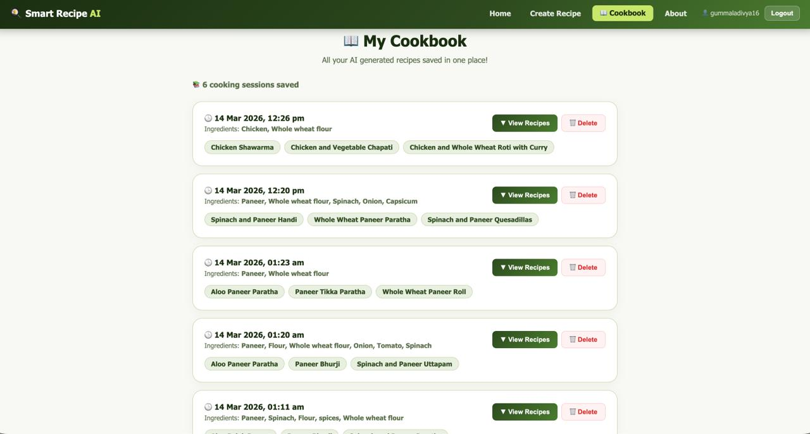

# 🍳 Smart Recipe AI

An AI-powered recipe generator that turns your ingredients into delicious recipes instantly!

Built as a B.Tech CSE (AIML) project at **SRM Institute of Science and Technology**.

---

## 📸 Screenshots

### Login Page


### Home Page


### Preferences & Ingredients


### Generated Recipes


### More Recipes


### Recipe Instructions


### Cooking Assistant


### My Cookbook


---

## ✨ Features

- 🤖 AI generates 6 personalized recipes from your ingredients
- 📸 Upload a photo — AI detects ingredients automatically
- 🌍 Recipes in 6 languages (English, Hindi, Tamil, Telugu, Spanish, French)
- ⚠️ Allergy filter — never includes allergens you select
- 🥗 Dietary preferences (Vegetarian, Vegan, Keto, Halal, Gluten-Free and more)
- 💬 Recipe-specific AI cooking assistant chatbot
- ⭐ Rate recipes 1 to 5 stars
- ❤️ Save favourite recipes
- 📖 Personal cookbook — all past recipes saved to your account
- 🔐 Secure login and signup with Firebase

---

## 🛠️ Tech Stack

| Technology | Purpose |
|------------|---------|
| React.js | Frontend UI |
| Node.js + Express | Backend Server |
| OpenRouter AI (Gemma) | AI Recipe Generation |
| Firebase Auth | User Authentication |
| Firestore | Recipe History Database |
| Unsplash API | Recipe Images |

---

## 🚀 How to Run Locally

### Backend Setup
```bash
cd server
npm install
```

Create a `.env` file in the server folder:
```
OPENROUTER_API_KEY=your_openrouter_key
UNSPLASH_ACCESS_KEY=your_unsplash_key
PORT=5001
```

Start the server:
```bash
node index.js
```

### Frontend Setup
```bash
cd client
npm install
npm start
```

App runs at `http://localhost:3000`

---

## 🎯 Future Enhancements

- 📱 Mobile App (React Native)
- 🛒 Grocery delivery integration (Swiggy/Blinkit)
- 📊 Nutrition and calorie tracking
- 🎥 YouTube video instructions
- 🤝 Social recipe sharing

---

*Built with ❤️ by Gummala Divya — SRM Institute of Science and Technology*
